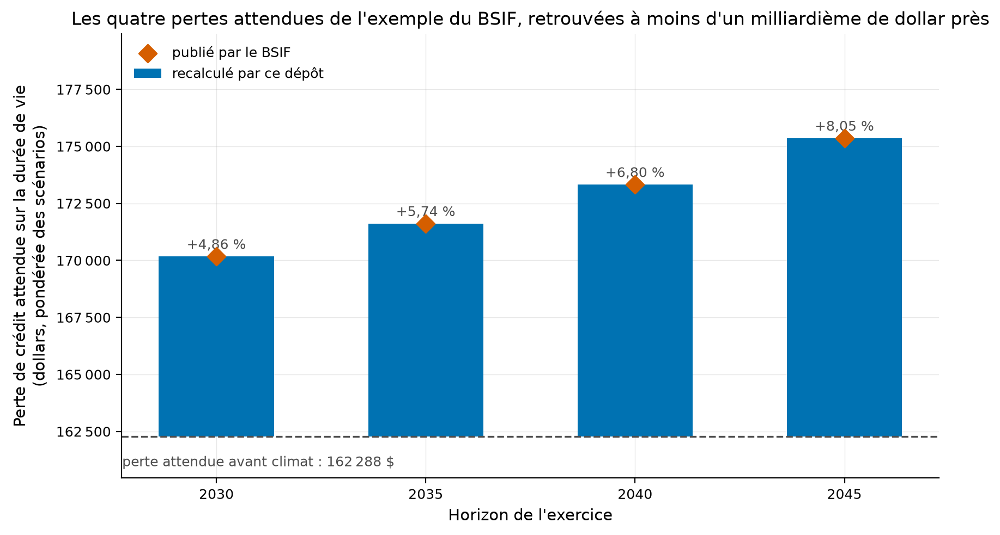
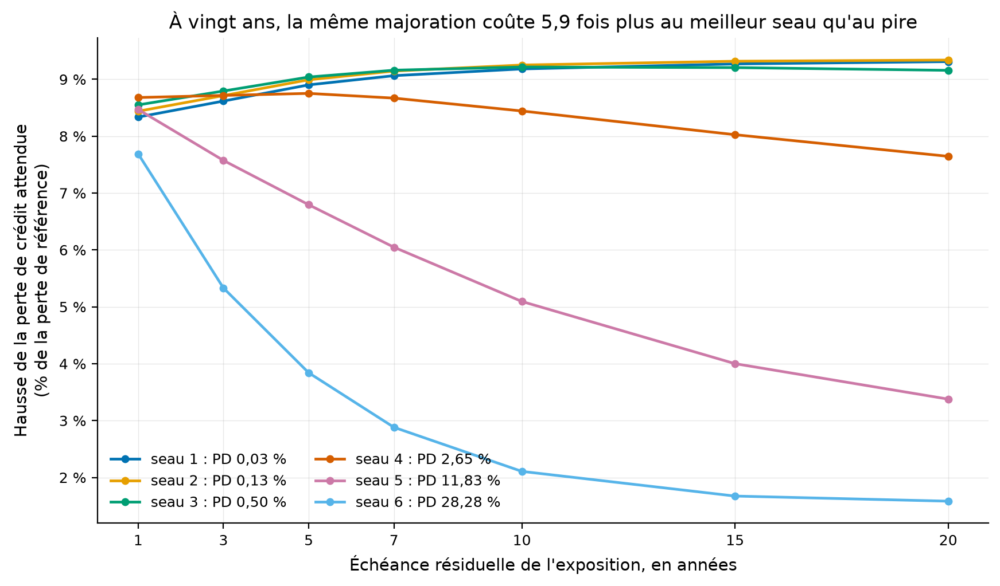
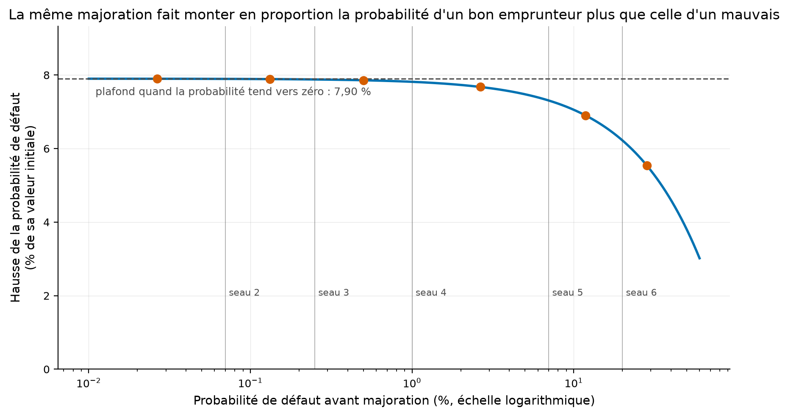
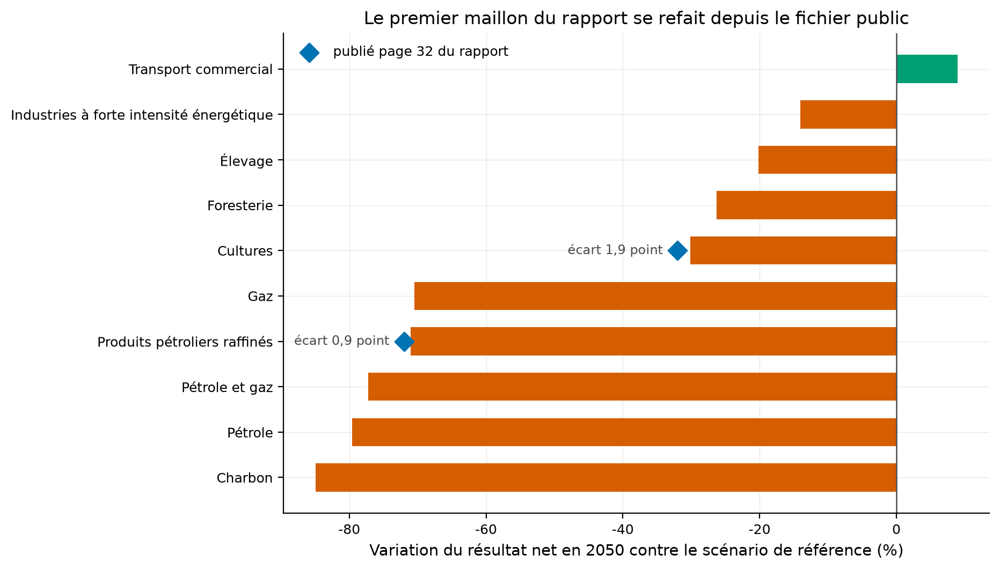
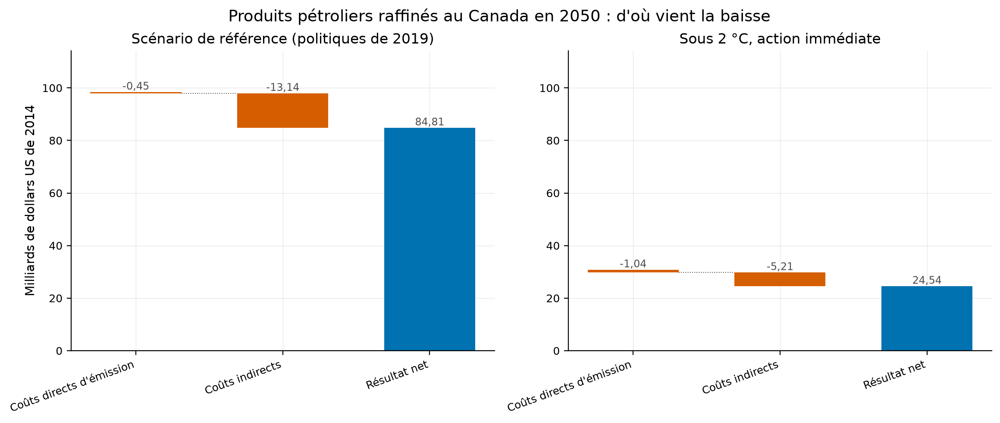
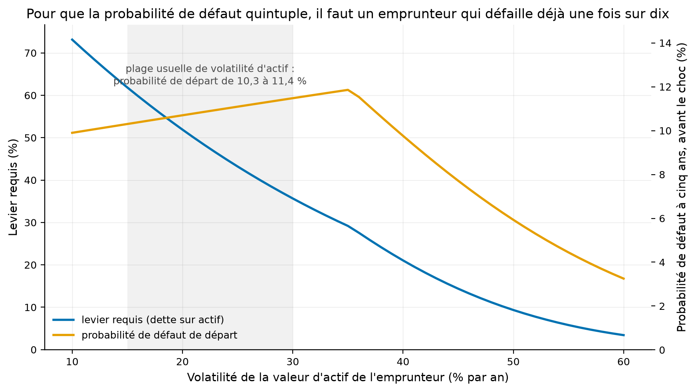

# L'exercice climatique du BSIF, recalculé : ce que la formule fait aux bons emprunteurs

Depuis 2024, toute institution financière fédérale canadienne doit rendre au BSIF un exercice
normalisé de scénarios climatiques. Le régulateur publie sa méthode, son classeur et un exemple
travaillé complet, et aucun dépôt public ne le calcule. Ce dépôt le calcule, le vérifie contre
l'exemple officiel, puis pose la question que l'exemple ne pose pas.

[](https://github.com/Guilou001/25-scenario-climatique-bsif/actions/workflows/ci.yml)


**Résultat en une phrase.** Le module de crédit de l'exercice est reproduit depuis les seules
formules publiées, et retrouve les huit nombres de l'exemple officiel du BSIF **à moins d'un
milliardième de dollar près** ; sur cette base, la majoration prescrite fait monter la perte de
crédit attendue de **9,3 % pour un emprunteur de la meilleure qualité à vingt ans, contre 1,6 % pour
le pire, soit 5,9 fois moins**, parce qu'une majoration constante sur l'échelle logit multiplie la
cote de défaut et non la probabilité.

*Summary in English. A from-scratch implementation of the credit module of OSFI's Standardized
Climate Scenario Exercise, reproducing every figure of the regulator's own worked example to within
1e-10 dollars, plus two extensions: a sensitivity map showing that a constant logit add-on raises
expected credit loss 5.9 times more for the best credit quality bucket than for the worst at twenty
years, and a Merton inversion of the 2022 BoC-OSFI pilot's published +450 % default probability.*

## 1. La question posée

Trois questions, dans l'ordre où elles se posent.

**La première est de vérification.** Le BSIF publie une méthode en toutes lettres et un exemple
chiffré. Un exercice réglementaire se code-t-il depuis ses formules seules, sans le tableur ? Si oui,
tout intermédiaire du dépôt se compare à un nombre publié, et le dépôt cesse d'être une
interprétation.

**La deuxième est de fond.** Le régulateur prescrit une majoration de probabilité de défaut par
secteur, région et qualité de crédit. Cette majoration s'ajoute au **logit** de la probabilité, le
logarithme de sa cote. Quelle exposition en souffre le plus ? La réponse n'est pas celle qu'on
attend, et elle est entièrement contenue dans la forme de la formule.

**La troisième est celle d'un chiffre resté seul.** Le rapport du projet pilote de 2022 annonce que
les produits pétroliers raffinés voient leur probabilité de défaut monter de 450 % d'ici 2050. D'où
vient ce nombre, et que faut-il supposer d'un emprunteur pour l'obtenir ?

En mots simples : un régulateur demande aux banques de dire combien le climat leur coûterait. Ce
dépôt refait le calcul, puis regarde qui la règle frappe et si le chiffre le plus cité tient debout.

## 2. D'où vient le projet, et ce qu'il apporte

L'**exercice normalisé de scénarios climatiques** est le calcul standardisé que le BSIF impose depuis
2024 : chaque institution rend, pour quatre horizons et trois trajectoires de transition, l'écart de
sa perte de crédit attendue. Les résultats du premier tour étaient dus le 13 décembre 2024 pour les
modules de crédit et de marché. Il fait suite au projet pilote mené en 2021 et 2022 par la Banque du
Canada et le BSIF avec six institutions.

Quatre apports.

- **Le module de crédit, écrit depuis les formules publiées** et non depuis le tableur, avec les huit
  nombres de l'exemple officiel retrouvés.
- **Une carte de sensibilité** qui n'existe nulle part : la hausse de perte attendue par seau de
  qualité de crédit et par échéance, sur la seule colonne de majorations publiée.
- **La reconstruction du premier maillon du rapport de 2022** depuis le fichier public, et la
  déclaration explicite que le second maillon n'est pas reconstructible.
- **Une inversion de Merton** qui répond à une question différente de celle du rapport, et le dit.

Aucun dépôt public ne traite ce sujet. La recherche du 2026-08-30 sur « OSFI standardized climate
scenario exercise » et « climate transition scenario credit » ne renvoie que deux dépôts, sans étoile,
dont aucun ne lit le fichier canadien.

## 3. Les données, et leur licence

Quatre fichiers publics, téléchargés par script, jamais commités. Tailles mesurées le 2026-08-30.

| Fichier | Ce qu'il contient | Taille | Licence |
|---|---|---:|---|
| `scse-instructions-enasc-en_2.xlsx` | 22 feuilles, dont cinq exemples travaillés ; c'est celui de crédit qui sert ici | 212 911 o | BSIF, usage avec attribution |
| `scse-workbook-classeur-enasc-en_0.xlsx` | le classeur à remplir, 13 feuilles | 1 971 516 o | BSIF, usage avec attribution |
| `climate-transition-scenario-data.csv` | 59 584 observations, 9 géographies, 4 scénarios, 15 secteurs, 66 variables, 2020 à 2050 sans trou | 7 026 127 o | Banque du Canada, usage et copie avec attribution |
| `BoC-OSFI-Using-Scenario-Analysis...pdf` | le rapport du pilote, 62 pages | 2 407 957 o | Banque du Canada et BSIF |

Comment lire ce tableau, en trois constats. Le premier est que la méthode elle-même n'est pas un
fichier : elle vit sur une page web du BSIF, formules comprises, et c'est de là que viennent les
quatre équations codées ici. Le deuxième est que l'adresse du rapport a dû être corrigée : elle est
sous `/uploads/2021/11/` et non sous `/uploads/2022/01/`, chemin qui répond **404** alors que le
rapport porte la date de janvier 2022. Le troisième est que le téléchargement passe par le magasin de
certificats du système, faute de quoi Python échoue là où `curl` réussit sur la même machine.

## 4. La méthode, pas à pas

1. **Passer à la probabilité conditionnelle.** La probabilité inconditionnelle de défaillir à
   l'année *i* est celle de défaillir cette année-là vue d'aujourd'hui ; la conditionnelle est celle
   de défaillir sachant qu'on a survécu jusque-là. On divise donc par la survie accumulée. Sur
   l'exemple, 3,5 % en deuxième année sur une survie de 96 % donne 3,645 833 % de conditionnelle.
2. **Ajouter la majoration sur l'échelle logit.** Le **logit** d'une probabilité *p* est
   `ln(p / (1 − p))`, le logarithme de sa cote. La majoration prescrite s'y ajoute, ce qui garantit
   que le résultat reste entre zéro et un.
3. **Revenir à l'inconditionnel** en remultipliant par les survies climatiques.
4. **Ajuster la perte en cas de défaut par la relation de Frye-Jacobs**, qui lie perte et
   probabilité de défaut par un seul paramètre : quand la probabilité monte, la perte en cas de
   défaut monte aussi, parce que les défaillances se concentrent dans les mauvaises années, où les
   garanties valent moins. Sur l'exemple, 80,00 % devient 80,24 % quand la probabilité passe de
   4,00 % à 4,30 %.
5. **Sommer la perte actualisée** année par année, produit de la probabilité, de la perte en cas de
   défaut et de l'exposition, puis pondérer les trois scénarios macroéconomiques.

## 5. Les résultats

### 5.1 L'exemple officiel, retrouvé jusqu'au dernier chiffre

L'exposition du cas est de trois millions de dollars sur le secteur du charbon au Canada, six ans de
vie restante, taux d'actualisation de 10 %, trois scénarios pondérés 60, 30 et 10 %.

| Grandeur | Recalculé | Publié par le BSIF | Écart |
|---|---:|---:|---:|
| Perte de référence, scénario pessimiste | 186 072,387 572 | 186 072,387 572 | 0 |
| Perte de référence, scénario de base | 131 137,225 870 | 131 137,225 870 | 0 |
| Perte de référence, scénario optimiste | 113 038,218 836 | 113 038,218 836 | 0 |
| Perte de référence, pondérée | 162 288,422 188 | 162 288,422 188 | 2,9e-11 |
| Perte climatique, horizon 2030 | 170 170,011 519 | 170 170,011 519 | 2,9e-11 |
| Perte climatique, horizon 2035 | 171 611,306 912 | 171 611,306 912 | -8,7e-11 |
| Perte climatique, horizon 2040 | 173 324,046 835 | 173 324,046 835 | -1,2e-10 |
| Perte climatique, horizon 2045 | 175 357,348 595 | 175 357,348 595 | -2,9e-11 |

Comment lire ce tableau, en trois constats. Le premier est que l'écart le plus grand vaut
1,2e-10 dollar sur 173 324 dollars, soit un écart relatif de 7e-16 : c'est la précision de
l'arithmétique flottante, donc l'égalité. Le deuxième est que les six probabilités et les six pertes
en cas de défaut de l'horizon 2045 sont retrouvées elles aussi, la première série exactement, la
seconde à 1,2e-15. Le troisième est que ces chiffres ne sont pas retapés à la main : la commande
`scc verifier` les ré-extrait du classeur téléchargé et compare, et les huit contrôles sortent
« identique ».



Comment lire cette figure : chaque barre part de la perte attendue avant climat, si bien que sa
hauteur est la hausse elle-même. Le losange est la valeur publiée par le BSIF, et il se pose au
sommet de sa barre à chaque horizon. L'exercice ajoute de 4,86 % à 8,05 % de perte attendue selon
l'horizon.

### 5.2 La majoration frappe les bons emprunteurs, en proportion

C'est le résultat que l'exemple officiel ne montre pas, parce qu'il ne porte que sur un seau de
qualité. La majoration s'ajoute au logit, donc **multiplie la cote de défaut** par l'exponentielle de
la majoration. Or la cote vaut presque la probabilité quand celle-ci est petite, et bien plus
qu'elle quand elle est grande.

| Seau de qualité | Probabilité de défaut annuelle | Hausse à 1 an | à 5 ans | à 20 ans |
|---|---:|---:|---:|---:|
| 1 | 0,03 % | 8,34 % | 8,90 % | **9,31 %** |
| 2 | 0,13 % | 8,44 % | 8,99 % | 9,34 % |
| 3 | 0,50 % | 8,55 % | 9,04 % | 9,16 % |
| 4 | 2,65 % | 8,68 % | 8,75 % | 7,65 % |
| 5 | 11,83 % | 8,47 % | 6,79 % | 3,38 % |
| 6 | 28,28 % | 7,69 % | 3,84 % | **1,58 %** |

Comment lire ce tableau, en trois constats. Le premier est que le rapport entre le meilleur et le
pire seau passe de 1,08 à un an à **5,88 à vingt ans** : la formule ne traite pas les qualités de
crédit de la même façon, et l'écart se creuse avec l'échéance. Le deuxième est le sens de cet écart,
contraire à l'intuition : c'est le **bon** emprunteur dont la perte attendue monte le plus, en
proportion. Le troisième est que l'effet de l'échéance change de signe selon le seau, croissant pour
les trois premiers et décroissant pour les trois derniers, parce qu'un emprunteur fragile a peu de
chances d'être encore là dans quinze ans, et que sa perte attendue lointaine pèse donc peu.



Comment lire cette figure : une ligne par seau de qualité, l'échéance en abscisse. Les trois lignes
du haut sont les trois meilleures qualités et elles montent avec l'échéance ; les deux du bas sont
les deux pires et elles s'effondrent.



Comment lire cette figure : en abscisse la probabilité de défaut avant majoration, en échelle
logarithmique ; en ordonnée la hausse qu'elle subit, en pourcentage de sa valeur initiale. La ligne
tiretée est le plafond `exp(majoration) − 1`, soit 7,90 % pour la majoration de 2046, atteint quand
la probabilité tend vers zéro. Les points marquent le milieu de chaque seau.

**Ce que cela change en pratique.** Une institution qui lit son résultat d'exercice verra la hausse
la plus forte sur la part la mieux notée et la plus longue de son livre, qui en est presque toujours
la plus grosse. Ce n'est pas un signal sur le risque climatique de ces expositions, c'est une
propriété de la fonction logit. Statut : **mesuré** sur la seule colonne de majorations publiée, celle
du charbon canadien au seau 4, appliquée à tous les seaux ; c'est une hypothèse, déclarée, et c'est
exactement ce qu'il faut pour isoler l'effet de la formule.

### 5.3 Le rapport de 2022 : un maillon se refait, l'autre pas

| Secteur | Résultat net 2050 recalculé | Publié page 32 | Écart |
|---|---:|---:|---:|
| Produits pétroliers raffinés | **-71,06 %** | -72 % | 0,94 point |
| Cultures | **-30,11 %** | -32 % | 1,89 point |
| Charbon | -84,94 % | non publié | |
| Pétrole | -79,59 % | non publié | |
| Gaz | -70,47 % | non publié | |
| Transport commercial | +8,91 % | non publié | |

Comment lire ce tableau, en trois constats. Le premier est que le résultat net ne figure pas dans le
fichier : il se construit comme les produits moins les coûts directs d'émission moins les coûts
indirects, et cette soustraction retrouve les deux valeurs publiées à un et deux points près. Le
deuxième est que l'écart résiduel n'est pas expliqué et s'écrit comme tel : il peut venir d'un
arrondi de publication, d'une pondération par l'exposition, ou d'une définition du résultat net
légèrement différente. Statut : **non expliqué**. Le troisième est que le secteur de l'électricité,
cité par le rapport, est absent de ce tableau parce que le fichier public ne porte pour lui ni
produits ni coûts : statut **non trouvé**, et non zéro.



Comment lire cette figure : une barre par secteur, la variation contre le scénario de référence. Les
deux losanges sont les seules valeurs que le rapport publie, et l'écart est écrit à côté de chacune.



Comment lire cette figure : deux cascades, la même échelle. Elle montre d'où vient la baisse, et ce
n'est pas d'où on l'attend. Les coûts directs d'émission ne montent que de **0,45 à 1,04 milliard**,
et les coûts indirects **baissent** de 13,14 à 5,21 milliards. Ce qui s'effondre, ce sont les
produits, de 98,4 à 30,8 milliards, soit **-68,7 %**. Le prix du carbone ne ruine pas le raffineur ;
la disparition de sa demande le ruine.

**Ce qui ne se refait pas.** Le rapport dit page 30 que la hausse de probabilité de défaut vient
d'évaluations d'emprunteurs faites par six institutions sur leurs propres dossiers, complétées par du
jugement d'expert, puis résumées par un modèle de type Merton. Ces évaluations ne sont pas publiques.
Le second maillon est donc **non reconstructible**, et le dépôt l'écrit plutôt que de fabriquer un
chiffre qui y ressemblerait.

### 5.4 Ce qu'il faudrait supposer pour obtenir +450 %

Une question différente se pose au même chiffre, et celle-là se répond. Dans le modèle de
**Merton**, qui traite les capitaux propres comme une option d'achat sur les actifs de l'entreprise,
quel emprunteur faudrait-il pour qu'une perte de valeur de 71,1 % multiplie sa probabilité de défaut
par 5,5 ?

| Horizon | Volatilité d'actif 15 % | 20 % | 25 % | 30 % | 40 % | 50 % |
|---|---:|---:|---:|---:|---:|---:|
| 1 an | 9,63 % | 9,82 % | 10,00 % | 10,17 % | 10,53 % | 10,89 % |
| 3 ans | 10,03 % | 10,34 % | 10,65 % | 10,95 % | 11,55 % | 10,31 % |
| 5 ans | 10,30 % | 10,70 % | 11,09 % | 11,48 % | 9,76 % | 5,93 % |
| 10 ans | 10,80 % | 11,35 % | 11,83 % | 8,74 % | 4,04 % | 1,54 % |

Comment lire ce tableau, en trois constats. Chaque case est la probabilité de défaut que l'emprunteur
devrait avoir **avant** le choc. Le premier constat est que dans la plage de volatilité d'actif
ordinaire d'une entreprise cotée, de 15 % à 30 %, la réponse tient entre **8,74 % et 11,83 %** quel
que soit l'horizon : il faut un emprunteur qui défaille déjà environ une fois sur dix, donc de
qualité spéculative, et non un emprunteur de première catégorie. Le deuxième est que hors de cette
plage, à 40 % et 50 % de volatilité sur des horizons longs, la réponse s'effondre jusqu'à 1,54 %, et
le dire fait partie du résultat. Le troisième est que ce calcul **n'est pas** celui de la Banque du
Canada : c'est une question posée à son chiffre, sous une hypothèse déclarée, celle que la valeur
d'actif suit le résultat net.



Comment lire cette figure : le levier requis à gauche, la probabilité de défaut de départ à droite,
et la bande grisée est la plage usuelle de volatilité d'actif.

## 6. Reproduire

```bash
uv sync --locked --all-extras
uv run pytest                 # 33 tests fermés, sans réseau, moins d'une seconde
uv run scc fetch              # les quatre fichiers publics, environ 11 Mo
uv run scc verifier           # les constantes du dépôt contre le classeur du BSIF
uv run scc tout               # les quatre calculs et les six figures
```

Les tests ne touchent jamais le réseau : la vérité connue vit dans `src/scc/exemple.py`, et
`scc verifier` est la commande qui prouve que cette vérité est bien celle du régulateur. Tous les
chiffres de ce README viennent des fichiers de `results/`.

## 7. Limites, avec leur statut

| Limite | Statut |
|---|---|
| Les majorations réelles de probabilité de défaut ne sont fournies qu'aux institutions déclarantes ; l'exemple n'en publie qu'une colonne, charbon, Canada, seau 4 | déclaré ; tout ce dépôt calcule sur cette colonne et sur un portefeuille stylisé, jamais sur une société nommée |
| La carte de sensibilité applique la majoration du seau 4 à tous les seaux | hypothèse déclarée ; c'est ce qui isole l'effet de la formule, et non une lecture du BSIF |
| L'écart de 0,94 et 1,89 point sur les deux valeurs publiées du rapport de 2022 | non expliqué ; arrondi de publication, pondération par l'exposition ou définition du résultat net sont les trois pistes, aucune n'est vérifiée |
| Le second maillon du rapport de 2022, du résultat net à la probabilité de défaut | non reconstructible ; les évaluations d'emprunteurs des six institutions ne sont pas publiques |
| L'inversion de Merton suppose que la valeur d'actif suit proportionnellement le résultat net | hypothèse déclarée ; elle répond à une autre question que celle du rapport, et le dépôt ne prétend pas le contraire |
| Le secteur de l'électricité n'a ni produits ni coûts dans le fichier public | non trouvé ; il est absent du tableau plutôt que compté zéro |
| Seuls les modules de crédit sont codés, pas ceux de marché, d'immobilier, d'inondation ni de feux de forêt | déclaré ; les quatre autres exemples travaillés du classeur restent ouverts |
| Le portefeuille stylisé prend un hasard de défaut constant, une perte en cas de défaut de 45 % et un taux de 5 % | hypothèses déclarées ; elles ne mettent aucune structure par terme dans le résultat |

## 8. Crédits, licence, citation

Données du Bureau du surintendant des institutions financières et de la Banque du Canada, employées
avec attribution et jamais redistribuées. Relation entre probabilité et perte en cas de défaut de
Jon Frye et Michael Jacobs (2012), telle que la méthode du BSIF la prescrit. Code sous licence MIT,
rapport sous licence CC BY 4.0. Figures produites par
[gv-fintools](https://github.com/Guilou001/gv-fintools), la couche partagée du portefeuille.

Voisinage dans le portefeuille : [10-credit-bancaire](https://github.com/Guilou001/10-credit-bancaire)
porte le modèle de probabilité de défaut et la perte attendue IFRS 9 hors climat, et
[17-alm-assurance-vie](https://github.com/Guilou001/17-alm-assurance-vie) porte le module de taux du
test de suffisance du capital des assureurs vie. Ce dépôt-ci ne refait ni l'un ni l'autre : il code
une mécanique réglementaire et mesure ce qu'elle fait.
